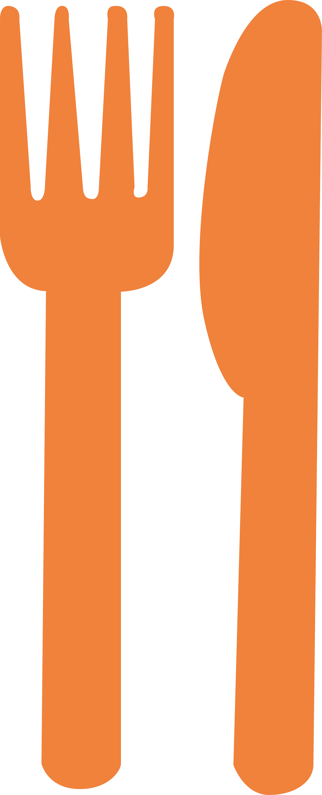
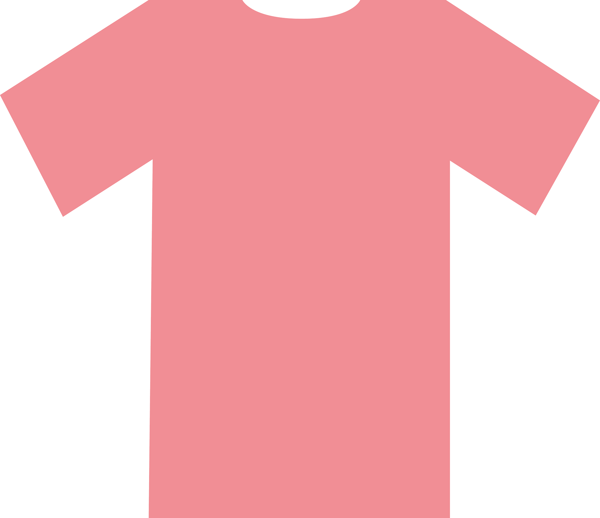

    
Uitstapjes

    <a href="restaurants.html"> 

        
Restaurants

        
        
    
</a>
    <a href="kledingwinkels.html"> 

        
Kledingwinkels

        
    
</a>
       
    
 
        <a href="index.html" class='roze' id='uitstapjes_homebutton'>
        
            <a href="banken.html"> 
        

        
Banken

        
    
        
        </a>
    </a>

